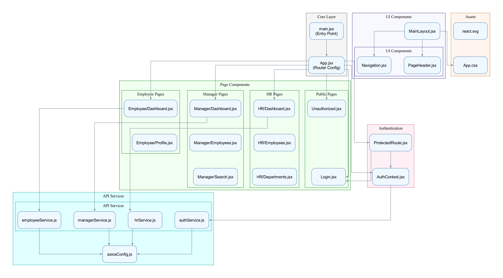
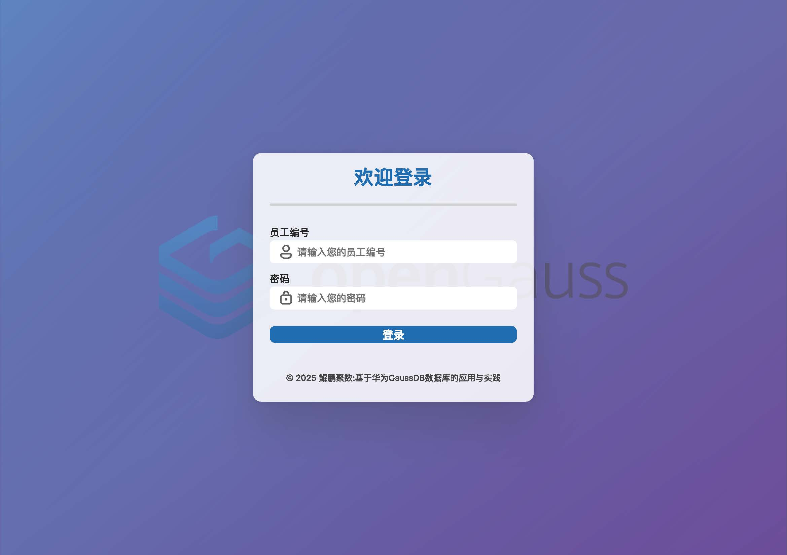
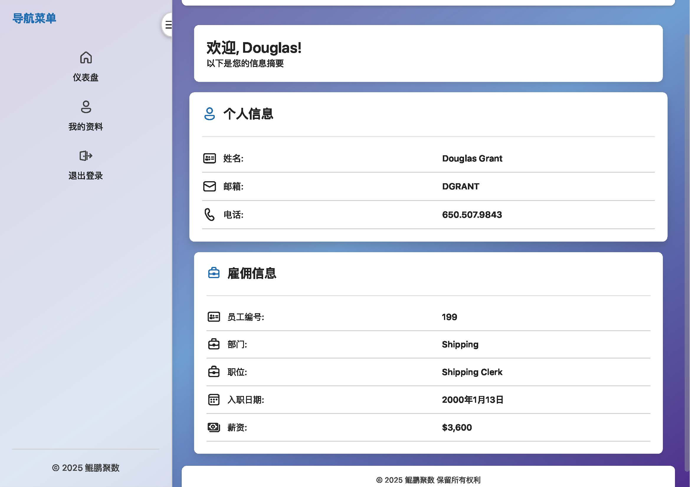
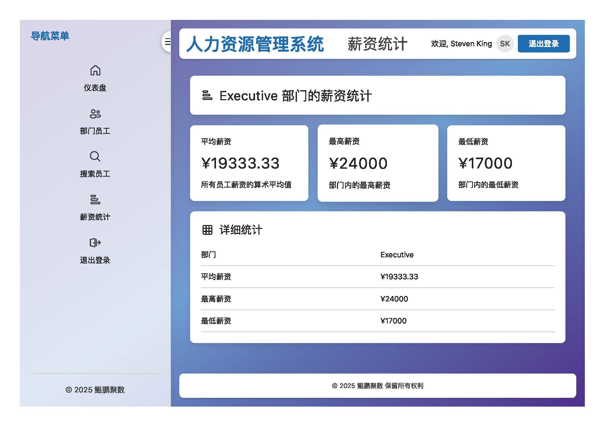

# UESTC-OpenGauss

**鲲鹏聚数** 是基于华为 [GaussDB](https://opengauss.org/) 构建的人力资源管理系统（HRMS）。项目采用前后端分离架构，具备现代化 UI 设计、完善的权限管理和企业级后端架构，适用于教学与实战演练。

> ✍️ 项目来源：📄

---

## 📐 架构总览

### 前端技术栈

- 核心框架：React 18 + Vite
- 状态管理：Context API
- UI 框架：Fluent UI v9 + Tailwind CSS
- 路由系统：React Router v6
- 样式设计：Fluent Design + 自定义 CSS 变量



### 后端技术栈

- 框架：Spring Boot 3.1.5
- 安全机制：Spring Security + JWT
- ORM：Hibernate + Spring Data JPA
- 数据库：openGauss
- API 文档：SpringDoc OpenAPI
- 构建工具：Gradle


---

## 🔐 权限角色矩阵

| 功能模块           | 员工 | 部门经理 | 人事经理 |
|--------------------|:----:|:--------:|:--------:|
| 查看个人信息       | ✅   | ✅       | ✅       |
| 修改电话号码       | ✅   | ❌       | ❌       |
| 管理部门员工       | ❌   | ✅       | ✅       |
| 系统配置与部门维护 | ❌   | ❌       | ✅       |

---

## 💡 核心功能

- 登录认证与角色分配
- 员工信息查看与更新
- 薪资统计可视化与图表展示
- 员工历史记录与工作地点管理
- 多角色界面（员工、经理、人事）
- 缓存优化与 JWT 安全机制





---

## 🚀 快速启动

### 前端启动

```bash
cd frontend-fluentv9
npm install
npm run dev
````

### 后端启动

```bash
cd backend
./gradlew bootRun
```

请预先配置并启动 openGauss 数据库服务。

---

## 📚 参考文献

* 华为 openGauss 数据库: [https://opengauss.org](https://opengauss.org)
